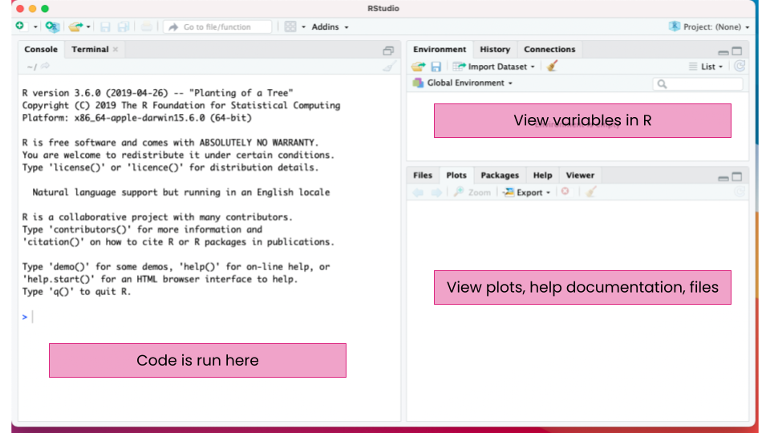
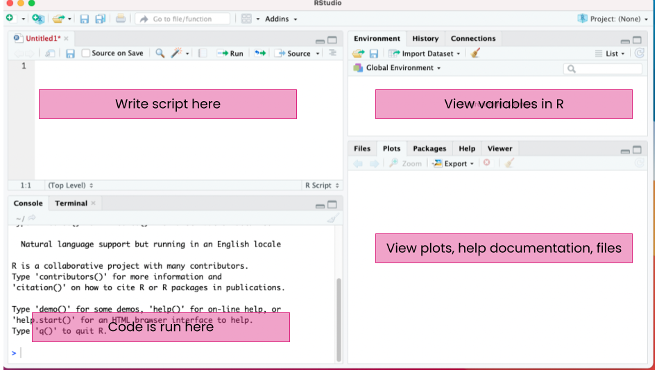

```{r setup, include=FALSE}
knitr::opts_chunk$set(echo = TRUE, warning = FALSE)
```

## Lab objectives

In this lab, students will create Walter's climate diagrams using the R software. Students will work with real climate data as a way to become familiar with performing analyses in R.

At the end of class, students can expect to be able to:

-   Become accustomed to the R environment and computing language
-   Perform basic mathematical calculations
-   Code simple summary statistics
-   Graph data using the `ggplot2` package
-   Evaluate the climate diagrams

## Introduction to R

### What is R?

R is a free, open source computing *software* used for statistical analysis and graphing. R is also a computing *language*. This means that R software interprets the R language, which is a specific set of vocabulary, formatting, and structure, to perform specific tasks. Other coding languages are Java, C++, python, etc.

R is widely used, especially among ecologists, because it is free and collaborative. Within R are *packages*, which are sets of functions that can be run in R, which usually have a very specific purpose. Anyone can create a package for personal use, but packages can also be published with thorough documentation, making them available for anyone to download and use. For example, some packages allow the user to download data onto their personal computer, some aid in making graphs, and some have functions for statistical analyses like creating phylogenetic trees or calculating species diversity.

### What is Rstudio?

Rstudio is software that runs the R software in a user friendly format. Rstudio allows the user to run R code, take notes, view graphs, and view files in one window.

We will be using Rstudio in class for computing assignments. It should look like this:



### Using R

The next few sections will go through common tasks performed in R, which are needed to complete analyses.

#### Mathematical calculations

R can perform basic mathematical calculations. To compute a calculations, simply type it in the *Console*. You can do addition (+), subtraction (-), multiplication (\*), division (/), power (\^), to name a few. You can also use parentheses as usual in mathematical equations.

For example for 5 times 2:

```{r}
5 * 2
```

One your own, try some mathematical calculations in the Console.

#### Functions in R

Most tasks in R will be accomplished using **functions**. Functions is code that is stored in R and will run a specific task.

Functions are run using the function name followed by the "arguments." A function can have any number of arguments.

{width="50%"}

Functions can range from very simple to very complex. Many functions exist in R without doing anything, you can "load" additional functions through "packages", or you can even make your own functions.

For example, `log` is a function that will take the natural log of the value given as an argument.

```{r}
log(1.5)
```

The `log` function can also take an addition argument which sets the base that the logarithms are computed. Two arguments are possible with `log`, x (or the value) and base. So to take the base 10 logarithm of the value 1.5, you could do the following:

```{r}
log(1.5, 10)
```

This could be written to include the names of the arguments to avoid confusion.

```{r}
log(x=1.5, base =10)
```

There are many other mathematical function such as sum, max, min, mean, median, sd (standard deviation). 

Hint: To get help with a specific function, use '?' followed by the function name

#### Assigning variables

In R, you can store information (numbers, tables, text, etc.) in variables. To do this, a variable is assigned a name using the characters `<-`. For example, to assign the letter a the value 1.5, type:

```{r}
a <- 1.5
```

Then, when you run `a`, you can see the value.

```{r,}
a
```

You can now treat `a` as 1.5. For example, you can take the log of `a`, which is the same as running `log(1.5)`

```{r}
log(a)
```

#### Data types

So far, we have only dealt with single numbers, but R can handle numbers or text. With numbers, you can type them in regularly and R will recognize them as such. Text is put into quotations ("").

For example, instead of a number, you can store text in a variable:

```{r}
b <- "hello"
```

Then when your run the varable `b`, you get the text as the output.

```{r}
b
```

There are other types of data, but numbers (numberic) and text (characters) are the two main types we will use in this class.

#### Data structures

Data can be stored in vectors, dataframes, and matrices.

**Vectors** are a one dimensional way to put together data of the *same* type (i.e. all text or all characters). The most common way to create a vectors is by using the `c()` function, which concatenates, or combines, values into a vector.

Here, a vector with the numbers 5, 10, 20 are made into a vector named example.vector

```{r}
example.vector <- c(5, 10, 20)
example.vector
```

You can also perform mathematical calculations or functions with vectors. The function is performed on each entry in the vector

```{r}
example.vector / 5
```

**Data frames** are are lists of vectors, like a table. In data frames, each column must have the same data type, but there can be different types of data in a data frame. This is widely used for storing data because you can have a column with the treatment name (text) and then a column of the measurement (number).

A data frame might look something like this

```{r, echo=F}
treatment <- c('control', 'control', 'control', 'high N', 'high N', 'high N', 'low N', 'low N', 'low N' )
growth <- c(5, 8, 6, 1, 8, 9, 5, 2,3)
df<- data.frame(treatment, growth)
df
```

A **matrix** is similar to a data frame except that *all data* in a matrix are the same type.

#### Using R script

So far, we have been running R in the console. However, it is best to write and run code from an R *script*. In a script, you can take notes, write code, and run code all from the same file. You can also save the file and re-run or go back and edit later. This is very important for reproducibility and accountability in science.

In Rstudio, the default is to have the script open above the console.



-   To add notes, add a '\#' to the beginning of a line. This line will not be run in R.
-   To run the code from the notebook, but your cursor on the line that you want to run. Then click "Ctrl + enter" on a Windows or Linux machine or 'Cmd + enter' on a Mac.

### Exercise: Class height

Now that you have learned basic R structure and functions, let's use the height of students in the class as an example.

The code for this exercise should be filled into the file climate-script.R that is provided to you on Moodle.

In this exercise:

1.  Collect the heights of each of the students in the class in inches
2.  Store the heights in a vector
3.  Calculate some summary statistics on the height of the class (ex. median, maximum, etc.)
4.  Plot a histogram of the heights. To make a histogram, you can use the function `hist`. You can look at the documentation for the function using `?hist`. Notice where the histogram is displayed in Rstudio.

## Climate data analysis

In the second part of the lab, we will use climate data from the [PRISM climate group](https://prism.oregonstate.edu/) to create Walter's climate diagrams. The PRISM Climate Group is a part of Oregon State University and creates datasets using weather stations across the United States. The data sets include total precipitation, maximum temperature, minimum temperature, mean temperature, dew point temperature, vapor pressure deficit, and measurements of global shortwave solar radiation.

We will start by creating a climate diagram for William Peace University for the year 2021. Climate diagrams graph the mean precipitation and temperature by month to visualize the climate of an area and can be useful in showing the seasonal variation and periods of drought.

### Install required packages

We will be using a couple of packages for the analysis in class. To install the packages `dplyr` and `ggplot2`, use the following code.

    install.packages("dplyr")
    install.packages("ggplot2")

You will only have to do this once. Now when you do analyses in the future, you will already have these packages.

### Loading the dataset

First, we will need to load the data into the R environment. Download the data file from Moodle named climate.csv. A csv (comma separated values) file is a file with the columns separated by commas. CSV files can be read with standard spreadsheet software, like excel or sheets. Although, sometimes ecological data that is analyzed in R is so large that it doesn't make sense to open in excel.

To load the data, we will use the function `read.csv`. We will name the variable in R `climate`

```{r read-data}
climate <- read.csv("climate.csv")
```

You will need to specify where the file is located on your computer. For example if it was in your Documents folder, you would type `read.csv("~/Documents/climate.csv")`. The easiest and most organized way to accomplish this is by making a folder on your computer for the analysis. Then, you can use the files tab on the right hand side of Rstudio to set that folder as your "working directory." As long as the data file is in that folder, the code above will work.

To view the first 10 rows of the file, run:

```{r}
head(climate, 10)
```

You can see all of the columns in the data set. The data includes the mean temperature (in degrees C) and mean precipitation (in mm) for each month for 10 different cities in the US for the years 1981, 1991, 2001, 2011, and 2021. The months in the data set are in numbers 1-12.

You can also evaluate the data using the `summary()` function.

### Filtering the data

To evaluate and manipulate the data we will use the `dplyr` package that you installed earlier. This package allows us to look at the data in a more intuitive way that some of the R functions loaded already in R.

To load the package, use the function, `library`:

```{r, warning = F, message=FALSE}
library(dplyr)
```

One useful function in the dplyr package is `filter`. This function allows you to view only some of the data rows, or it "filters" the data by a specific. To use the `filter` function, you need 2 arguments: 1) the data you are working with and 2) how you want to filter. First, let's filter to only show data from Raleigh. The code would be:

```{r filter-city}
filter(climate, City=="Raleigh")
```

The output is all the rows of the data frame from Raleigh. To specify this, we used `City == "Raleigh`. This means to show where the data in the column "City" is equal to the the text "Raleigh".

We can also use more than one filter. To show all data from Raleigh in 2021:

```{r filter-city-year}
filter(climate, City == "Raleigh", year == "2021")
```

One handy thing in `dplyr` is the use of the "%\>%" pipe which can be used to chain functions. The pipe uses the following format:

    data %>%
      function 1 %>%
      function 2 %>%
      function 3

You can use as many functions as you would like. For example, you can see that `filter(climate, City == "Raleigh", year == "2021")` is the same as

```{r another-filter}
climate %>%
  filter(City == "Raleigh") %>%
  filter(year == "2021")
```

We can also use the `summarize` function to make summary statistics for the data. For example, we could get the average, or mean, temperature and mean precipitation in Raleigh in 2021. To do this, we would first filter the data and then summarize. To use `summarize`, you must state the name of the new column(s) you are creating with the summarized data and what function you are using to summarize. For example, you could use `sum`, `n`, `max`, etc.

```{r summarize}
climate %>% 
  filter(City =="Raleigh") %>%
  summarize(mean.temp = mean(temp), mean.precip = mean(precip))
```

With the summarize function, we created a new columns, mean.temp and mean.precip which take the mean of temperature and mean of precipitation, respectively.

### Plotting the data

When working with data, it is good practice to plot the data to evaluate it. This can help identify trends or even problems in the data.

We will use the package `ggplot2` to plot data. `ggplot` uses layers to plot data. The first layer using the function `ggplot` sets up the visualization. Then additional layers are "added" on which are used to plot the data (ex. bars, points, lines) and add styles, formats, etc.

For example, to plot the temperature by month, we could use the following code:

```{r plot-temp, warning = F, out.width="75%"}
library(ggplot2)  
ggplot(data=climate, aes(x=month, y=temp)) +
  geom_point()
```

What is happening here is `ggplot` takes the argument data (where we add our data frame) and aes. `aes` is the aesthetic. This is where you indicate which column in your data frame is the x axis and which is the y. Here we have temperature in the column "temp" on the y axis and "month" from 1-12 on the x axis. Then the layer `geom_point` is added on using `+` which adds the points for the data.

### Grouping the data

In this graph, every row in the data frame `climate` is a separate point on the plot. We can also summarize the data and plot. For example, for each city, instead of having a point for each year and month, we could have the *mean* temperature in each month.

To do this, we will use the `summarize` function, like we used before, but in conjunction with the function `group_by`.

```{r group-summarize}
climate_sum <- climate %>%
  group_by(City, State, month) %>%
  summarize(mean.temp = mean(temp), mean.precip=mean(precip))
```

In this code, we create a new data frame, "climate_sum" which has the mean temperature and mean precipitation for each city for each month. First the code specifies that we want the groups to by City, State, and Month. Then we use `summarize` as we did before to get the mean temperature and precipitation.

```{r}
climate_sum
```

We can now plot the summarized data, now using the climate_sum data frame.

First, we can plot the temperature.

```{r plot-mean-temp, out.width="75%"}
ggplot(data = climate_sum, aes(x = month, y = mean.temp)) +
  geom_point()
```

Next, we can plot the precipitation

```{r plot-mean-precip, out.width="75%"}
ggplot(data = climate_sum, aes(x = month, y = mean.precip)) +
  geom_point()
```

\*\* What do you notice about the 2 plots?\*\*

### Formating with color

In `ggplot`, you can also add in color to the plot. You can do this in a couple ways. First, you can make all the points a different color by using the argument "color" in `geom_point.`

Here, we make all the points red.

```{r red, out.width="75%"}
ggplot(data = climate_sum, aes(x = month, y = mean.temp)) +
  geom_point(color = 'red')
```

You can also color based on a column in the data from by adding color = column_name in the aes in `ggplot`.

Play around with the color argument in aes.

    ggplot(data = climate_sum, aes(x = month, y = mean.temp, color = )) +
      geom_point()

## Making a Climate Diagram

In the Walter's Climate diagram, both temperature and precipiation is plotted by month. Let's start with making a climate diagram for Raleigh in 2021.

First, we will plot just the temperature in Raleigh 2021. Let's also make the temperature points all red. One difference here is that we moved the aesthetic for the y axis to the `geom_point`. This will allow us to use multiple y axes (temperature *and* precipitation)

```{r temp-red, out.width="75%"}
ggplot(data = filter(climate, City == "Raleigh", year =="2021" ), aes(x=month)) +
  geom_point(aes(y=temp), col='red')
```

If we want to connect the points, we can add a line using `geom_line` using the same arguements.

```{r line-temp, out.width="75%"}
ggplot(data = filter(climate, City == "Raleigh", year =="2021" ), aes(x=month)) +
  geom_point(aes(y=temp), color='red') +
  geom_line(aes(y=temp), color = 'red')
```

Just like we can with variables, we can assign plots to variables.

```{r temp-diagram}
temp_raleigh_21 <- ggplot(data = filter(climate, City == "Raleigh", year =="2021" ), aes(x=month)) +
  geom_point(aes(y=temp), col='red')+
  geom_line(aes(y=temp), col='red')
```

Because ggplot uses layers, we can simply add the precipitation values to the temperature plot. Let's make precipitation blue.

```{r climate-diagram}
climate_raleigh_21 <- temp_raleigh_21 + 
  geom_point(aes(y=precip), color='blue')+
  geom_line(aes(y=precip), color='blue') +
  scale_y_continuous( sec.axis = sec_axis(~.*2)) 
```

The Walter's climate diagrams have a specific way of lining up temperature and precipitation. Here the `scale_y_continuous` was used to line up the y axes for temperature in precipitation.

To view the plot, simply run the name of the plot

```{r, out.width="75%"}
climate_raleigh_21
```

And now you have your climate diagram for Raleigh in 2021!

**Evaluate the climate diagram**. Is this what you expect given the biome we are in? Is there anything unexpected?

### Formatting the climate diagram

There are still a couple of things we can do to format or change the climate diagram. In ggplot, you have a lot of control on all the formatting of the plots. We can change the axis labels and title for the plot and add in the month letters instead of numbers by adding additional formatting layers.

```{r pretty, warning = F, out.width="75%"}
climate_raleigh_21 +
    scale_y_continuous('Mean Temperature (C)',  
                       sec.axis = sec_axis(~.*2, 'Mean Precipitation (mm)')) +
    scale_x_continuous('Month', breaks=1:12,  
                       labels=c('J', 'F', 'M', 'A', 'M', 'J','J','A','S','O', 'N','D')) + 
    ggtitle('Climate Diagram for Raleigh, NC') +
    theme_bw()
```

Here we used:

-   ggtitle to add a title
-   scale_y\_continuous to change the y axis names
-   scale_y\_continuous to change the break points and names on the x axis
-   theme_bw to change the theme.

There are many themes you can use for ggplot inlcuding `theme_minimal`, `theme_gray`, `theme_classic`. Try out a couple to see which you prefer.

Lastly, we can also plot a climate diagram using the average of all the years in the data frame instead of just one using the climate_sum data frame we created earlier.

```{r sum-diagram, out.width="75%"}
ggplot(data = filter(climate_sum, City=='Raleigh'), aes(x=month)) +
  geom_point(aes(y=mean.temp), col='red')+
  geom_line(aes(y=mean.temp), col='red')+
  geom_point(aes(y=mean.precip), col = 'blue')+
  geom_line(aes(y=mean.precip), col = 'blue')+
  scale_y_continuous('Mean Temperature (C)',  
                     sec.axis = sec_axis(~.*2, 'Mean Precipitation (mm)')) +
  scale_x_continuous('Month', breaks=1:12,  
                     labels=c('J', 'F', 'M', 'A', 'M', 'J','J','A','S','O', 'N','D')) + 
  ggtitle('Climate Diagram for Raleigh, NC') +
  theme_bw()
```

To save the graph, you can use the `ggsave` function. Add as an argument the name of the file.

    ggsave("Raleigh_climate.pdf")

## Exercise 2

So far, we have only plotted the data for Raleigh, NC. However, you will notice that there are more cities in the table.

Here is a map of the cities in the data file:

```{r cities, echo=FALSE, include = F, message = FALSE}
cities<-read.csv('climate-locations.csv')
cities <- cities %>%
  mutate(City = recode(City, 'Ajo '= 'Ajo'))
kableExtra::kable(cities)
```

```{r cities_map, echo = F, message=F, out.width="75%"}
library(sf)
library(ggrepel)

usa <- st_as_sf(maps::map("state", fill=TRUE, plot =FALSE))

locs <- cities %>%
  filter(complete.cases(.)) %>% # your CSV has blank rows between the cities
  st_as_sf(coords = c('Long', 'Lat'), crs = 4326)

# I got fancy on line 14 with the ggrepel but you can get rid of that if you don't want it.
ggplot(usa) +
  geom_sf(color = "#2b2b2b", fill = "white", size=0.125) +
  geom_sf(data = locs, color = "#56B4E9", size = 2) +
  ggrepel::geom_label_repel(data = locs, aes(label = paste0(City, ', ', State), geometry = geometry), stat = 'sf_coordinates') +
  coord_sf(crs = st_crs("+proj=laea +lat_0=45 +lon_0=-100 +x_0=0 +y_0=0 +a=6370997 +b=6370997 +units=m +no_defs"), datum = NA) +
  ggthemes::theme_map()
```

In the next part of lab, make at least **three** additional climate diagrams in R. Include your code in the climate-script.R file.

Things to think about after creating the diagrams:

1.  Why did you pick the three cities you did?
2.  Are the diagrams you expect given the biome of the city?
3.  How do the diagrams compare?
4.  Are the results expected or unexpected based on what you know about the cities or climate diagrams in general?

## Lab notebook instructions

In the lab notebook entry for this week include:

-   **Objective**: Describe the goal of the lab?
-   **Methods**: A short summary of the methods. You do not need to go through the details of all the code, but what your were aiming tplot-mean-tempo accomplish in R.
-   **Results**: Add the climate diagrams plots to the results. You can save each of the plots with the `ggsave` function.
-   **Conclusions**: Write up a couple of paragraphs of your conclusions for the lab. Think about the questions in exercise 2.
-   **Questions**: What questions do you have about the lab?

## References

PRISM Climate Group, Oregon State University, <https://prism.oregonstate.edu>, data created 4 Feb 2014, accessed 13 Aug 2022.
